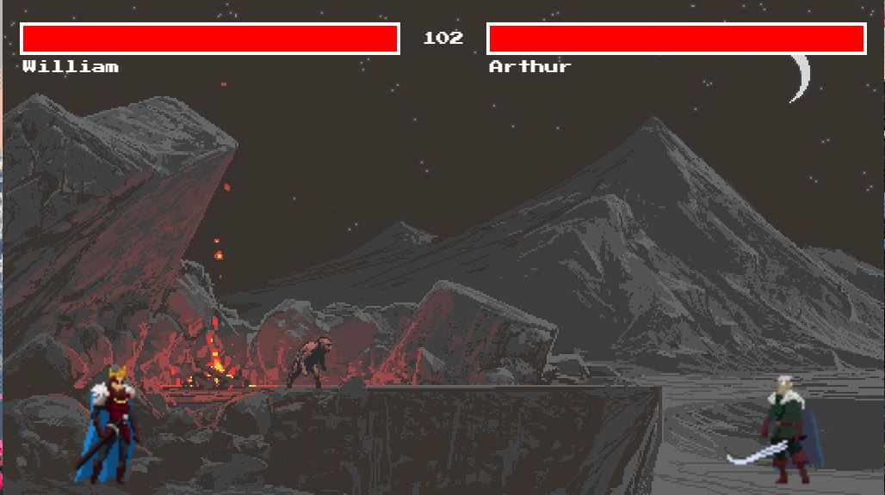

# The Shadow Of Death

A simple two-player fighting game built using HTML, CSS, and JavaScript.

## How to Play

1. Open the `index.html` file in your web browser.
2. Click the Play Button
3. Use the arrow keys to move Arthur, down to hit and for William used WAD for movement and S for hitting
4. The first player to beat out their opponent wins!

## Game Rules

- Each player has a health bar at the top of the screen.
- Players can only hit when they are close enough to their opponent.
- Hitting reduces the opponent's health.
- If a player's health reaches zero, they are dead out and the game ends.
- If the time limit of 120 seconds is reached, the player with the most health remaining wins.

## Credits

- Sprites obtained from [LuizMelo](https://luizmelo.itch.io/)
